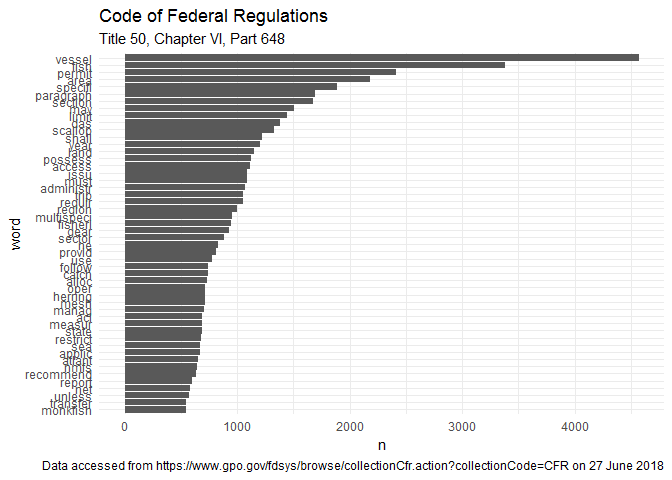

<!-- README.md is generated from README.Rmd. Please edit that file -->
fedregs
=======

The goal of fedregs is to allow for easy exploration and analysis of the [Code of Federal Regulation](https://www.gpo.gov/fdsys/browse/collectionCfr.action?selectedYearFrom=2017&go=Go).

Installation
------------

You can install fedregs from github with:

``` r
# install.packages("devtools")
devtools::install_github("slarge/fedregs")
```

Example
-------

The Code of federal regulations is organized according to a consistent hierarchy: title, chapter, part, subpart, section, and subsection. Right now, I'm mostly interested in a specific part and maybe the associated subparts for a given year. The `cfr_text()` function does a few things. First, each title within the CFR is divided into volumes. Unfortunately, each chapter isn't consistently in the same volume so the function gathers all the URLs for a given title/year combination. These URLs are parsed to document the chapters, parts, and subparts associated with the volume and the target URLs are further parsed to provide a data frame of the text for each subpart. The `return_tidytext = TRUE` argument will return a tibble with the text in a [tidytext]() format.

``` r
library(fedregs)
#> Loading required package: magrittr
library(dplyr)
#> 
#> Attaching package: 'dplyr'
#> The following objects are masked from 'package:stats':
#> 
#>     filter, lag
#> The following objects are masked from 'package:base':
#> 
#>     intersect, setdiff, setequal, union
library(tidyr)
#> 
#> Attaching package: 'tidyr'
#> The following object is masked from 'package:magrittr':
#> 
#>     extract
library(ggplot2)
#> 
#> Attaching package: 'ggplot2'
#> The following object is masked from 'package:dplyr':
#> 
#>     vars
library(quanteda)
#> Package version: 1.3.0
#> Parallel computing: 2 of 4 threads used.
#> See https://quanteda.io for tutorials and examples.
#> 
#> Attaching package: 'quanteda'
#> The following object is masked from 'package:utils':
#> 
#>     View

regs <- cfr_text(year = 2017,
                 title_number = 50,
                 chapter = 6,
                 part = 648,
                 return_tidytext = TRUE,
                 verbose = TRUE)
#> All urls for title 50 in 2017 should be fine.
#> Pulling the chapter, part, and volume information from:
#> https://www.gpo.gov/fdsys/bulkdata/CFR/2017/title-50/CFR-2017-title50-vol9.xml.
#> Pulling the chapter, part, and volume information from:
#> https://www.gpo.gov/fdsys/bulkdata/CFR/2017/title-50/CFR-2017-title50-vol8.xml.
#> Pulling the chapter, part, and volume information from:
#> https://www.gpo.gov/fdsys/bulkdata/CFR/2017/title-50/CFR-2017-title50-vol7.xml.
#> Pulling the chapter, part, and volume information from:
#> https://www.gpo.gov/fdsys/bulkdata/CFR/2017/title-50/CFR-2017-title50-vol6.xml.
#> Pulling the chapter, part, and volume information from:
#> https://www.gpo.gov/fdsys/bulkdata/CFR/2017/title-50/CFR-2017-title50-vol5.xml.
#> Pulling the chapter, part, and volume information from:
#> https://www.gpo.gov/fdsys/bulkdata/CFR/2017/title-50/CFR-2017-title50-vol4.xml.
#> Pulling the chapter, part, and volume information from:
#> https://www.gpo.gov/fdsys/bulkdata/CFR/2017/title-50/CFR-2017-title50-vol3.xml.
#> Pulling the chapter, part, and volume information from:
#> https://www.gpo.gov/fdsys/bulkdata/CFR/2017/title-50/CFR-2017-title50-vol2.xml.
#> Pulling the chapter, part, and volume information from:
#> https://www.gpo.gov/fdsys/bulkdata/CFR/2017/title-50/CFR-2017-title50-vol13.xml.
#> Pulling the chapter, part, and volume information from:
#> https://www.gpo.gov/fdsys/bulkdata/CFR/2017/title-50/CFR-2017-title50-vol12.xml.
#> Pulling the chapter, part, and volume information from:
#> https://www.gpo.gov/fdsys/bulkdata/CFR/2017/title-50/CFR-2017-title50-vol11.xml.
#> Pulling the chapter, part, and volume information from:
#> https://www.gpo.gov/fdsys/bulkdata/CFR/2017/title-50/CFR-2017-title50-vol10.xml.
#> Pulling the chapter, part, and volume information from:
#> https://www.gpo.gov/fdsys/bulkdata/CFR/2017/title-50/CFR-2017-title50-vol1.xml.
head(regs)
#> # A tibble: 6 x 6
#>    year title_number chapter  part subpart                       data     
#>   <dbl>        <dbl> <chr>   <dbl> <chr>                         <list>   
#> 1  2017           50 VI        648 Subpart A—General Provisions  <tibble ~
#> 2  2017           50 VI        648 Subpart B—Management Measure~ <tibble ~
#> 3  2017           50 VI        648 Subpart C—Management Measure~ <tibble ~
#> 4  2017           50 VI        648 Subpart D—Management Measure~ <tibble ~
#> 5  2017           50 VI        648 Subpart E—Management Measure~ <tibble ~
#> 6  2017           50 VI        648 Subpart F—Management Measure~ <tibble ~
```

Now, we can unnest the tibble and take a peek at the data to see what we have to poke at.

``` r
regs %>%
  unnest() %>% head(20) %>% pull(word)
#>  [1] "c"          "a"          "this"       "part"       "implements"
#>  [6] "the"        "fishery"    "management" "plans"      "fmps"      
#> [11] "for"        "the"        "atlantic"   "mackerel"   "squid"     
#> [16] "and"        "butterfish" "fisheries"  "atlantic"   "mackerel"
```

Not entirely unexpected, but there are quite a few common words that don't mean anything. These "stop words"" typically don't have important significance and and are filtered out from search queries.

``` r
head(stopwords("english"))
#> [1] "i"      "me"     "my"     "myself" "we"     "our"
```

There are some other messes like punctuation, numbers, *i*ths, Roman Numerals, web sites, and random letters (probably from indexed lists) that can be removed with some regex-ing. We can also convert the raw words to word stems to further aggregate our data.

``` r
stop_words <- data_frame(word = stopwords("english"))

clean_words <- regs %>%
  unnest() %>% 
  mutate(word = gsub("[[:punct:]]", "", word), # remove any remaining punctuation
                word = gsub("^[[:digit:]]*", "", word)) %>%  # remove digits (e.g., 1st, 1881a, 15th, etc)
  anti_join(stop_words, by = "word") %>%  # remove "stop words"
  filter(is.na(as.numeric(word)),
                !grepl("^m{0,4}(cm|cd|d?c{0,3})(xc|xl|l?x{0,3})(ix|iv|v?i{0,3})$",
                      word),
                !grepl("\\b[a-z]{1}\\b", word), # get rid of one letter words
                !grepl("\\bwww*.", word)) %>% # get rid of web addresses
  mutate(word = tokens(word),
                word = as.character(tokens_wordstem(word)))
#> Warning in ~is.na(as.numeric(word)): NAs introduced by coercion
head(clean_words)
#> # A tibble: 6 x 7
#>    year title_number chapter  part subpart           SECTION_NUMBER word  
#>   <dbl>        <dbl> <chr>   <dbl> <chr>             <chr>          <chr> 
#> 1  2017           50 VI        648 Subpart A—Genera~ §<U+2009>648.1        part  
#> 2  2017           50 VI        648 Subpart A—Genera~ §<U+2009>648.1        imple~
#> 3  2017           50 VI        648 Subpart A—Genera~ §<U+2009>648.1        fishe~
#> 4  2017           50 VI        648 Subpart A—Genera~ §<U+2009>648.1        manag 
#> 5  2017           50 VI        648 Subpart A—Genera~ §<U+2009>648.1        plan  
#> 6  2017           50 VI        648 Subpart A—Genera~ §<U+2009>648.1        fmps
```

Now we can look at binning and plotting the words

``` r
count_words <- clean_words %>%
  group_by(word) %>%
  summarise(n = n()) %>%
  ungroup() %>%
  arrange(-n) %>% 
  top_n(n = 50, wt = n) %>% 
  mutate(word = reorder(word, n))
```

``` r
ggplot(count_words, aes(word, n)) +
  geom_col() +
  labs(xlab = NULL, title = "Code of Federal Regulations", subtitle = "Title 50, Chapter VI, Part 648",
       caption = sprintf("Data accessed from https://www.gpo.gov/fdsys/browse/collectionCfr.action?collectionCode=CFR on %s", format(Sys.Date(), "%d %B %Y"))) +
  theme(axis.text.x = element_text(angle = 45, hjust = 1),
        legend.direction = "horizontal", legend.position = "bottom",
        text = element_text(size = 8)) +
  coord_flip() +
  theme_minimal()
```


