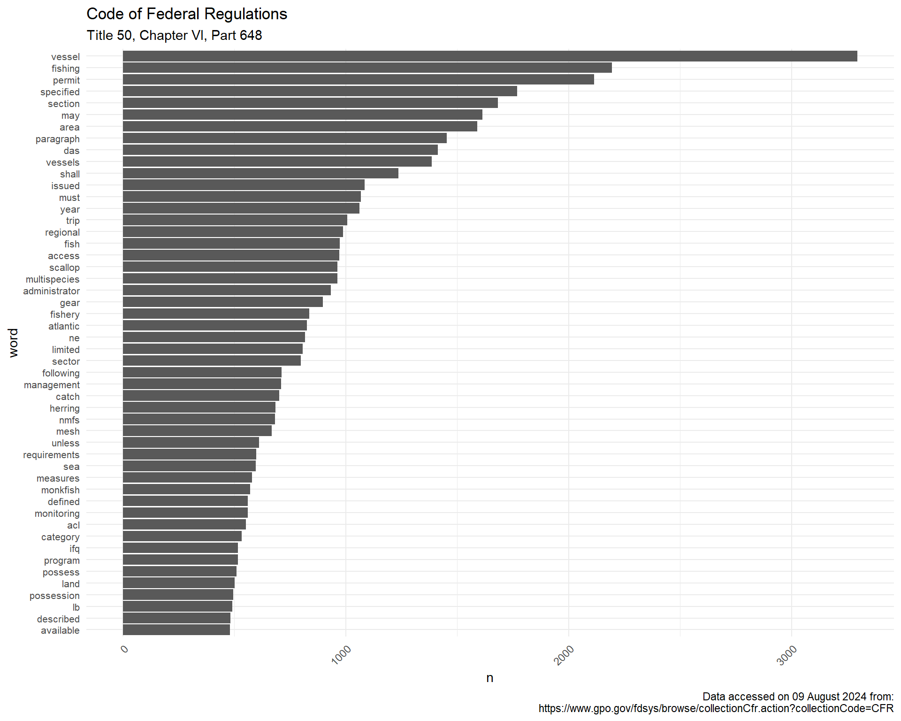

<!-- README.md is generated from README.Rmd. Please edit that file -->
'fedregs': Text Analysis of the US Code of Federal Regulations
--------------------------------------------------------------

[](http://www.repostatus.org/#active) [](https://codecov.io/gh/slarge/fedregs) [](https://travis-ci.org/slarge/fedregs) <!-- [](https://cran.r-project.org/package=fedregs) --> <!--  --> <!-- [](https://gist.github.com/slarge/be2f2c14fd78cac24697) -->

The goal of `fedregs` is to allow for easy exploration and analysis of the [Code of Federal Regulation](https://www.gpo.gov/fdsys/browse/collectionCfr.action?selectedYearFrom=2017&go=Go).

Installation
------------

You can install `fedregs` using:

``` r
install.packages("fedregs")
# Or: devtools::install_github("slarge/fedregs")
```

Example
-------

The [Code of Federal Regulation](https://www.gpo.gov/help/index.html#about_code_of_federal_regulations.htm) is organized according to a consistent hierarchy: title, chapter, part, subpart, section, and subsection. Each title within the CFR is (somewhat haphazardly) divided into volumes and over time each chapter isn't consistently in the same volume. The `cfr_text()` function is the main function in the package and it will return the text for a specified part, including the associated subparts and sections. Behind the scenes, `cfr_text()` and associated helper functions gather the URLs for a given title/year combination and parses XML to determine the chapters, parts, and subparts associated with each volume. Next, the text is extracted for each subpart. The `return_tidytext = TRUE` argument will return a tibble with the text in a [tidytext](https://www.tidytextmining.com/tidytext.html) format. If *ngrams* are your game, set `token = "ngrams"` and specify `n`.

``` r
library(fedregs)
library(dplyr)
library(tidyr)
library(ggplot2)
library(quanteda)

regs <- cfr_text(year = 2017,
                 title_number = 50,
                 chapter = 6,
                 part = 648,
                 #token = "ngrams", # uncomment for ngrams of length 2
                 #n = 2, # uncomment for ngrams of length 2
                 return_tidytext = TRUE,
                 verbose = FALSE)
head(regs)
## # A tibble: 6 x 6
##    year title_number chapter  part subpart                       data     
##   <dbl>        <dbl> <chr>   <dbl> <chr>                         <list>   
## 1  2017           50 VI        648 Subpart A—General Provisions  <tibble ~
## 2  2017           50 VI        648 Subpart B—Management Measure~ <tibble ~
## 3  2017           50 VI        648 Subpart C—Management Measure~ <tibble ~
## 4  2017           50 VI        648 Subpart D—Management Measure~ <tibble ~
## 5  2017           50 VI        648 <NA>                          <tibble ~
## 6  2017           50 VI        648 Subpart E—Management Measure~ <tibble ~
```

Now, we can unnest the tibble and take a peek at the data to see what data we have to play with.

``` r
regs %>%
  unnest() %>% head(20) %>% pull(word)
##  [1] "c"          "a"          "this"       "part"       "implements"
##  [6] "the"        "fishery"    "management" "plans"      "fmps"      
## [11] "for"        "the"        "atlantic"   "mackerel"   "squid"     
## [16] "and"        "butterfish" "fisheries"  "atlantic"   "mackerel"
```

Not entirely unexpected, but there are quite a few common words that don't mean anything. These "stop words" typically don't have important significance and and are filtered out from search queries.

``` r
head(stopwords("english"))
## [1] "i"      "me"     "my"     "myself" "we"     "our"
```

There are some other messes like punctuation, numbers, *i*ths, Roman Numerals, web sites, and random letters (probably from indexed lists) that can be removed with some simple regex-ing. We can also convert the raw words to word stems to further aggregate our data.

``` r
stop_words <- data_frame(word = stopwords("english"))

clean_words <- regs %>%
  unnest() %>% 
  mutate(word = gsub("[[:punct:]]", "", word), # remove any remaining punctuation
                word = gsub("^[[:digit:]]*", "", word)) %>%  # remove digits (e.g., 1st, 1881a, 15th, etc)
  anti_join(stop_words, by = "word") %>%  # remove "stop words"
  filter(is.na(as.numeric(word)),
                !grepl("^m{0,4}(cm|cd|d?c{0,3})(xc|xl|l?x{0,3})(ix|iv|v?i{0,3})$",
                      word), # adios Roman Numerals
                !grepl("\\b[a-z]{1}\\b", word), # get rid of one letter words
                !grepl("\\bwww*.", word)) %>% # get rid of web addresses
  mutate(word = tokens(word),
                word = as.character(tokens_wordstem(word)))
## Warning in ~is.na(as.numeric(word)): NAs introduced by coercion
head(clean_words)
## # A tibble: 6 x 9
##    year title_number chapter  part subpart     SECTION_NAME SECTION_NUMBER
##   <dbl>        <dbl> <chr>   <dbl> <chr>       <chr>        <chr>         
## 1  2017           50 VI        648 Subpart A—~ Purpose and~ §<U+2009>648.1       
## 2  2017           50 VI        648 Subpart A—~ Purpose and~ §<U+2009>648.1       
## 3  2017           50 VI        648 Subpart A—~ Purpose and~ §<U+2009>648.1       
## 4  2017           50 VI        648 Subpart A—~ Purpose and~ §<U+2009>648.1       
## 5  2017           50 VI        648 Subpart A—~ Purpose and~ §<U+2009>648.1       
## 6  2017           50 VI        648 Subpart A—~ Purpose and~ §<U+2009>648.1       
## # ... with 2 more variables: values <chr>, word <chr>
```

Now we can look at binning and plotting the words

``` r
count_words <- clean_words %>%
  group_by(word) %>%
  summarise(n = n()) %>%
  ungroup() %>%
  arrange(-n) %>% 
  top_n(n = 50, wt = n) %>% 
  mutate(word = reorder(word, n))
```

``` r
ggplot(count_words, aes(word, n)) +
  geom_col() +
  labs(xlab = NULL, 
       title = "Code of Federal Regulations", 
       subtitle = "Title 50, Chapter VI, Part 648",
       caption = sprintf("Data accessed on %s from:\n https://www.gpo.gov/fdsys/browse/collectionCfr.action?collectionCode=CFR", 
                         format(Sys.Date(), "%d %B %Y"))) +
  theme(axis.text.x = element_text(angle = 45, hjust = 1),
        legend.direction = "horizontal",
        legend.position = "bottom",
        text = element_text(size = 8)) +
  coord_flip() +
  theme_minimal()
```


